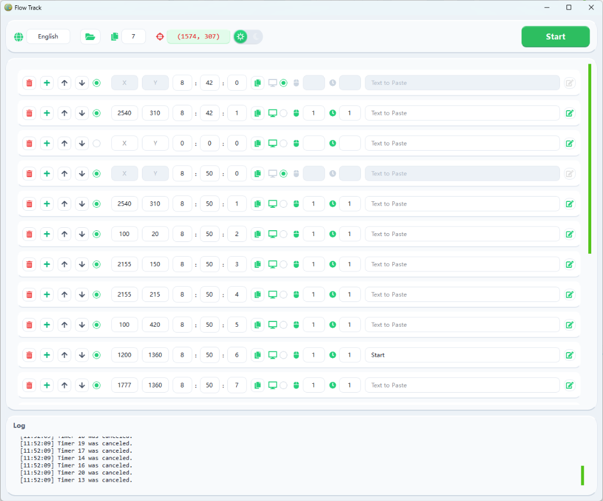

# Flow Track

[中文文档](README_CN.md)

Flow Track is a lightweight, high-precision desktop automation utility. It empowers users to preset a sequence of click and text-pasting tasks at exact timestamps, freeing your hands from repetitive manual operations.



- **Premium UI**: "Flow Track" Cyber-Green geek design with Glassmorphism, tailored for a fluid and high-tech user experience.
- **Full Tooltip Support**: Every icon and input field is equipped with bilingual hover-over explanations, significantly lowering the learning curve.
- **Precise Scheduling**: Uses high-fidelity 3-spinbox time inputs (HH:MM:SS) for intuitive and accurate scheduling.
- **Text Pasting**: Supports pasting multi-line text with an independent pop-up text editor, preserving formatting and indentation.
- **Integrated Logging**: Real-time activity logs presented in a cohesive glassmorphic card for instant feedback.
- **Auto-Countdown Exit**: Optional feature. Once all scheduled tasks complete, the app enters a 10s countdown and closes securely.
- **Window Memory**: Automatically remembers and restores window position and size from the previous session.
- **Bilingual Support**: Instant switching between **English** and **Chinese** with high-fidelity translations.
- **Portable & Persistent**: Single EXE distribution that saves user-specific settings to `config/config.ini`.
- **High Stability**: Robust ARGB rendering and event-interception logic prevent glitches and accidental input changes.

## 🏗️ Architecture

Flow Track follows a modular **separation of concerns** design to ensure maintainability and high performance:

- **Core Engine**: Encapsulates automation logic, configuration management, and localized i18n support.
- **Worker Threading**: Utilizes `QThread` to handle background mouse monitoring and movement, ensuring a lag-free UI experience.
- **Glassmorphic UI Layer**: A modern interface built with PySide6, featuring custom styled widgets with real-time ARGB rendering and shadow effects.

## 📂 Project Structure

```text
flow_track/
├── assets/          # Static resources (Icons, localized strings)
├── config/          # User specific configurations (Auto-generated)
├── core/            # Backend logic (Automation, ConfigMgr, I18n)
├── ui/              # Frontend components (Themes, Crystal Widgets, Main Window)
├── main.py          # Application entry point
└── main.spec        # PyInstaller build specification
```

## 🛠️ Development & Setup

### 1. Download & Run
Download the latest compiled version from the [Releases](https://github.com/julianhopkingson/flow_track/releases) page. Just double-click `flow_track.exe` to start. *(Note: If you are upgrading, make sure to close the current app using `taskkill /F /IM flow_track.exe`)*

### 2. Build from Source
If you want to modify the code or build your own version:

```bash
# Clone the repository
git clone https://github.com/julianhopkingson/flow_track.git
cd flow_track

# Install dependencies
pip install -r requirements.txt

# Run in development mode
python main.py

# Build executable (Single EXE)
pyinstaller main.spec --clean --noconfirm
```

## ⚙️ Configuration Guide

> **Note**: The configuration file `config/config.ini` will be automatically generated upon initial program execution.

- **Language**: Current UI language (中文/English).
- **Copy Range**: Number of tasks to sync downwards when copying.
- **Auto Close**: Set to `True` to enable auto-closing the app when all tasks are done.
- **Auto Close Delay**: Countdown duration (seconds) before auto-closing.
- **Timer Sections**: Specific settings for each task row (coordinates, clicks, paste text, etc.).

## 📄 License
This project is open-sourced under the [MIT](LICENSE) License - please refer to the LICENSE file for details.
