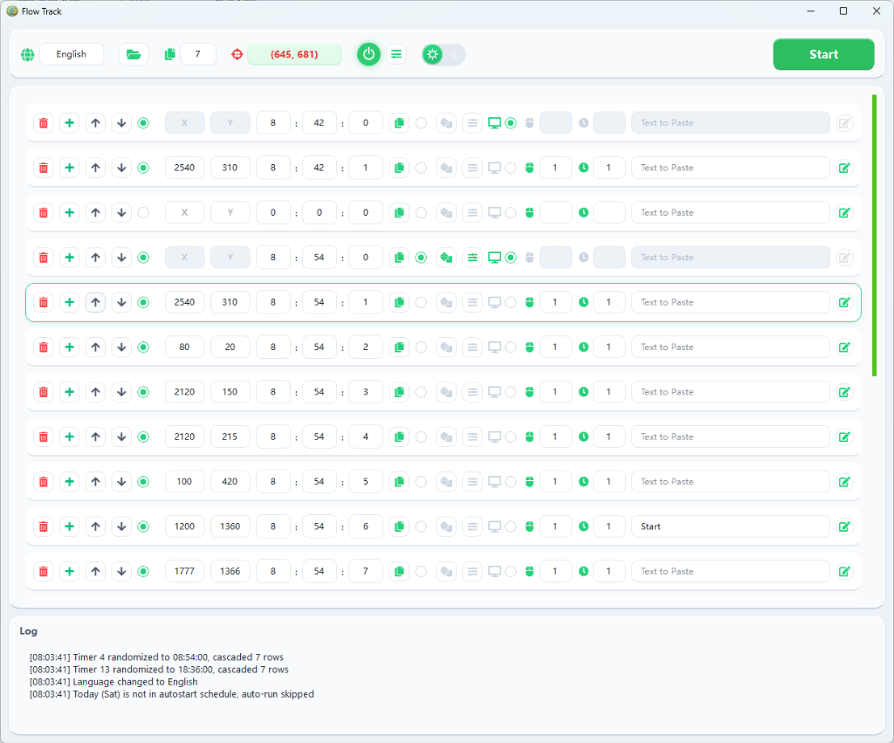

# Flow Track

[中文文档](README_CN.md)

Flow Track is a lightweight, high-precision desktop automation utility. It empowers users to preset a sequence of click and text-pasting tasks at exact timestamps, freeing your hands from repetitive manual operations.



- **Premium UI**: "Flow Track" Cyber-Green design with Glassmorphism, tailored for a fluid and state-of-the-art interactive experience.
- **Precise Scheduling**: High-fidelity 3-spinbox time inputs (HH:MM:SS) ensure tasks run with microsecond-level precision.
- **Random Time Jitter & Cascade**: Flexible random time windows with deduplication intervals, automatic downward sequential cascade, and one-click re-rolls.
- **Autostart & Weekly Schedule**: Registry-based autostart with self-healing paths, 7-day independent weekly schedule toggles, weekday auto-execution, and weekend silence.
- **Multi-Action Task Orchestration**: Screen coordinate targeting, configurable click intervals, quick desktop-minimize mode, and effortless row duplication/reordering.
- **Text Pasting & Zero-Latency Editor**: Fast multi-line text pasting equipped with an independent zero-latency pop-up editor and Auto-Home alignment.
- **Light / Dark Mode**: Smooth Sun/Moon animated theme transitions, supporting vibrant light mode and sleek dark mode with persistent user preferences.
- **Integrated Logging & Comprehensive Tooltips**: Real-time activity logs in glassmorphic cards, with bilingual hover-over tooltips for every control across the interface.
- **Security & Auto-Shutdown**: Optional 10s countdown safe termination upon completing all tasks, backed by Windows Kernel Mutex to prevent duplicate instances.
- **Bilingual & Portable Persistence**: Instant English/Chinese switching and single-file portable EXE distribution with persistent settings in `config/config.ini`.

## 🏗️ Architecture

Flow Track follows a modular **separation of concerns** design to ensure maintainability and high performance:

- **Core Engine**: Encapsulates automation logic, Windows startup registry management (AutoStartMgr), configuration management, and localized i18n support.
- **Worker Threading**: Utilizes `QThread` to handle background mouse monitoring and movement, ensuring a lag-free UI experience.
- **Glassmorphic UI Layer**: A modern interface built with PySide6, featuring custom styled widgets with real-time ARGB rendering and shadow effects.

## 📂 Project Structure

```text
flow_track/
├── assets/          # Static resources (Icons, localized strings, previews)
├── config/          # User specific configurations (Auto-generated)
├── core/            # Backend logic (Automation, AutoStartMgr, ConfigMgr, I18n)
├── ui/              # Frontend components (Themes, Crystal Widgets, Main Window)
├── main.py          # Application entry point
└── main.spec        # PyInstaller build specification
```

## 🛠️ Development & Setup

### 1. Download & Run
Download the latest compiled version from the [Releases](https://github.com/julianhopkingson/flow_track/releases) page. Just double-click `flow_track.exe` to start. *(Note: If you are upgrading, make sure to close the current app using `taskkill /F /IM flow_track.exe`)*

### 2. Build from Source
If you want to modify the code or build your own version:

```bash
# Clone the repository
git clone https://github.com/julianhopkingson/flow_track.git
cd flow_track

# Install dependencies
pip install -r requirements.txt

# Run in development mode
python main.py

# Build executable (Single EXE)
pyinstaller main.spec --clean --noconfirm
```

## ⚙️ Configuration Guide

> **Note**: The configuration file `config/config.ini` will be automatically generated upon initial program execution.

- **Language**: Current UI language (中文/English).
- **Theme**: UI theme preference (Light/Dark).
- **Autostart**: Set to `true` to enable automatic launch on Windows boot.
- **Autostart Days**: 7-item boolean list (`autostart_days = 1,1,1,1,1,0,0`) defining which days of the week autostart execution takes place (Monday to Sunday).
- **Copy Range**: Number of tasks to sync downwards when copying.
- **Auto Close**: Set to `True` to enable auto-closing the app when all tasks are done.
- **Auto Close Delay**: Countdown duration (seconds) before auto-closing.
- **Timer Sections**: Specific settings for each task row:
  - `enabled`, `x`, `y`, `time`, `clicks`, `interval`, `paste_text`: Basic task execution parameters;
  - `random_enabled`: Whether random time jitter is enabled for this row;
  - `random_start_h/m`, `random_end_h/m`: Lower and upper bounds of the random time window;
  - `random_min_interval`: Minimum interval (minutes) required between consecutive runs;
  - `random_last_time`: Snapshot of the most recently generated absolute timestamp.

## 📄 License
This project is open-sourced under the [MIT](LICENSE) License - please refer to the LICENSE file for details.

```markdown
📌 Flow Track Feature Overview
├── 🎛️ Automation Control Core
│   ├── ⏰ Precise Scheduling (3-spinbox high-fidelity time input, microsecond trigger)
│   ├── 🎲 Random Time & Cascading (Range jitter, deduplication interval, downward auto-fill)
│   ├── 📋 Smart Paste Editor (Zero-latency multi-line editor with Auto-Home alignment)
│   └── 🖥️ Desktop Mode & Multi-point Action (Quick minimize to desktop, free coordinates & clicks)
├── 🎨 High-End Interactive UI
│   ├── 🟢 Cyber-Geek Aesthetics (Emerald glow accent with 3D raised touch)
│   ├── 📅 Weekly Autostart Schedule (7-day toggle capsules, smart weekday filter & weekend silence)
│   ├── 🌗 Seamless Dark/Light Switching (Sun/Moon vector transition with persistent memory)
│   └── 🌐 Instant Bilingual Support (Comprehensive tooltips and millisecond hot-reload)
└── 🛡️ Enterprise Robustness
    ├── ⚡ Zero-UAC Windows Autostart (Registry managed, self-healing single-EXE path)
    ├── 🔒 Single-Instance Mutex (Windows Kernel Mutex prevents duplicate launches)
    └── ⏳ Auto Countdown Shutdown (Optional graceful self-closing without manual intervention)
```
