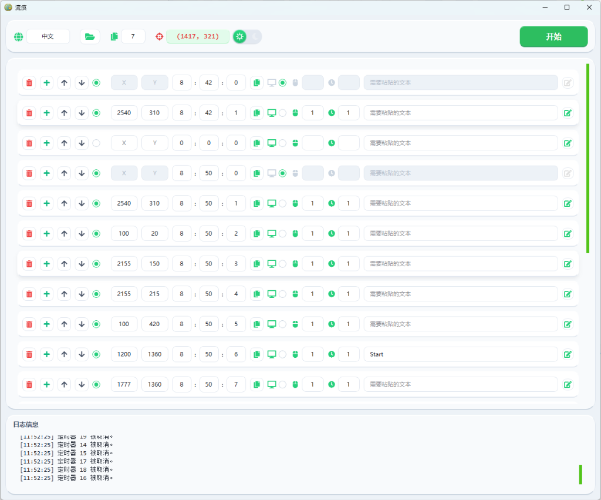

# 流痕 (Flow Track)

[English Version](README.md)

> **捕捉操作瞬间，构建自动化律动。**

「流痕」是一款轻量级、高精度的桌面端定时自动化工具。它允许用户通过直观的界面预设一系列具有精确时间点的点击与文本粘贴任务，帮助您在复杂的连续性工作中解放双手。



- **高级质感 UI**：采用 "Flow Track" 赛博绿极客设计，结合毛玻璃特效 (Glassmorphism)，打造流畅的高级交互体验。
- **精准定时触发**：采用高保真三旋钮时间输入 (HH:MM:SS)，确保任务在预设时刻分毫不差地执行。
- **备注编辑**：交互式弹窗编辑器，支持长文本与多行备注，在保持主界面整洁的同时完美保留数据。
- **集成日志系统**：实时活动日志以毛玻璃卡片样式呈现，任务执行状态一目了然。
- **窗口位置记忆**：自动记录并还原上次会话的窗口位置与大小。
- **多语言支持**：支持 **中文** 与 **英文** 实时切换，提供高质量的本地化体验。
- **便捷持久化存储**：单文件 EXE 分发，自动将用户设定保存至 `config/config.ini`。
- **极高稳定性**：健壮的 ARGB 渲染机制与事件拦截逻辑，有效防止黑屏、闪退及滚动过程中的数据变更。

## 🏗️ 技术架构

「流痕」遵循模块化的 **关注点分离** 设计，以确保高可维护性与高性能：

- **核心引擎 (Core Engine)**：封装自动化逻辑、配置管理及多语言 i18n 支持。
- **工作线程 (Worker Threading)**：利用 `QThread` 处理后台鼠标监控与移动，确保 UI 体验流畅无卡顿。
- **毛玻璃 UI 层 (Glassmorphic UI Layer)**：基于 PySide6 构建的现代界面，具备实时 ARGB 渲染与动态阴影效果。

## 📂 项目结构

```text
flow_track/
├── assets/          # 静态资源 (图标、本地化字符串)
├── config/          # 用户自定义配置 (自动生成)
├── core/            # 后端逻辑 (自动化、配置管理、国际化)
├── ui/              # 前端组件 (主题样式、定制化控件、主窗口)
├── main.py          # 应用程序入口
└── main.spec        # PyInstaller 构建配置文件
```

## 🛠️ 开发与安装指南

### 1. 下载与运行
从 [Releases](https://github.com/julianhopkingson/flow_track/releases) 页面下载最新的编译版本。直接双击 `flow_track.exe` 即可启动。*(注意：如果您正在进行升级，请确保先使用 `taskkill /F /IM flow_track.exe` 关闭当前运行的程序)*

### 2. 源码构建
如果您希望修改代码或构建自定义版本：

```bash
# 克隆仓库
git clone https://github.com/julianhopkingson/flow_track.git
cd flow_track

# 安装依赖项
pip install -r requirements.txt

# 以开发模式运行
python main.py

# 构建可执行文件 (单文件 EXE)
pyinstaller main.spec --clean --noconfirm
```

## ⚙️ 配置说明

> **注意**：配置文件 `config/config.ini` 将在程序首次运行时自动生成。

- **Language**: 当前界面语言 (中文/English)。
- **Copy Range**: 任务复制时的步进范围（每次复制增加的秒数）。
- **Timer Sections**: 每一行定时器的具体配置（坐标、点击次数、粘贴内容等）。

## 📄 开源协议
本项目采用 [MIT](LICENSE) 协议开源 - 详情请参阅 LICENSE 文件。
