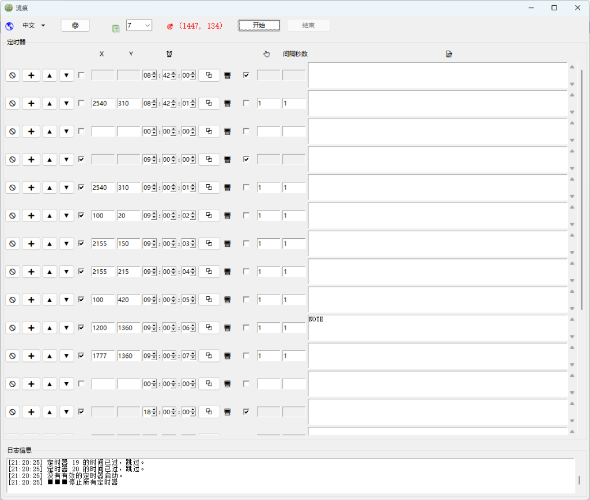

# 流痕 (Flow Track)

[English Version](README.md)

> **捕捉操作瞬间，构建自动化律动。**

「流痕」是一款轻量级、高精度的桌面端定时自动化工具。它允许用户通过直观的界面预设一系列具有精确时间点的点击与文本粘贴任务，帮助您在复杂的连续性工作中解放双手。



## ✨ 核心特性

- **精准定时触发**：支持秒级配置，确保任务在预设时刻分毫不差地执行。
- **智能化坐标拾取**：集成实时坐标探测，一键捕捉目标位置。
- **多任务序列流**：支持无限添加任务行，自由组合点击、延时、显示桌面等操作。
- **配置云存档 (Local)**：自动保存上次操作设定至 `config/` 目录，随开随用。
- **全资源嵌入设计**：图标与语言包完美嵌入，打包后单 EXE 文件即可独立运行，不留任何散落在外的资源文件。

## 🚀 快速开始

### 直接运行
1. 下载最新的发布包。
2. 运行 `dist/flow_track.exe`。
3. 如果是在新环境运行，软件会自动创建 `config/` 目录用于存储您的个人设定。

### 源码运行 (Python)
1. 确保安装了 Python 3.9+。
2. 安装依赖：
   ```bash
   pip install pywin32 pyperclip
   ```
3. 启动程序：
   ```bash
   python flow_track.py
   ```

## 🛠️ 构建说明

本项目使用 PyInstaller 进行单文件封装。执行以下命令即可生成完全独立的 EXE：

```bash
pyinstaller flow_track.spec --noconfirm
```

## 📄 授权协议
本项目采用 [MIT](LICENSE) 许可证。
