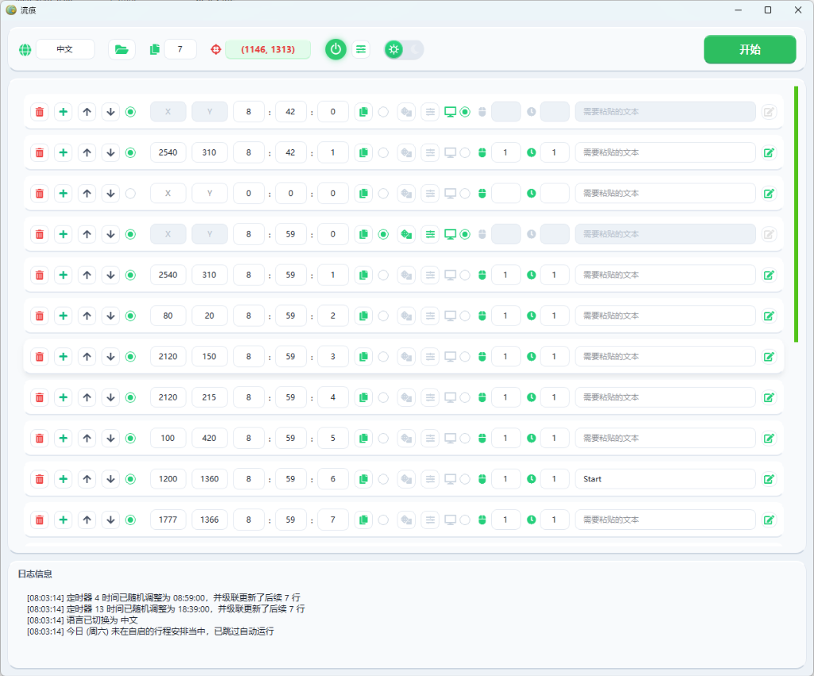

# 流痕 (Flow Track)

[English Version](README.md)

「流痕」是一款轻量级、高精度的桌面端定时自动化工具。它允许用户通过直观的界面预设一系列具有精确时间点的点击与文本粘贴任务，帮助您在复杂的连续性工作中解放双手。



- **高级质感 UI**：采用 "Flow Track" 赛博绿极客设计，结合毛玻璃特效 (Glassmorphism)，打造流畅的高级交互体验。
- **精准定时触发**：采用高保真三旋钮时间输入 (HH:MM:SS)，确保任务在预设时刻分毫不差地精确执行。
- **随机时间浮动与级联衍生**：支持时间区间随机波动与防重间隔机制，选中后可自动向下级联填充秒级递增序列，并支持一键重新随机抽取。
- **开机自启与按周行程安排**：基于 Windows 注册表静默管理与路径自愈，支持周一至周日 7 天独立行程开关，工作日自动执行、非排程日静默跳过。
- **多点任务编排**：支持屏幕绝对坐标捕获、自定义点击次数与间隔、一键最小化切回桌面，以及任务行的快速复制与顺序调整。
- **文本粘贴与零延迟编辑**：支持多行文本快速粘贴，内置独立的零延迟编辑器，并支持长文本智能归位对齐。
- **浅色 / 深色模式**：支持清爽浅色与专业深色主题无缝切换，配备平滑的日/月矢量微动画并自动记忆偏好。
- **集成日志与全量交互提示**：实时活动日志以毛玻璃卡片呈现，界面所有图标与输入框均配备详尽的中英双语悬停说明 (Tooltips)。
- **安全机制与自动退出**：所有预设定时任务执行完毕后支持 10 秒倒计时安全自退出，并基于 Windows 内核级互斥体彻底杜绝多开冲突。
- **多语言与便携持久化**：支持中文与英文即时热切换，单文件 EXE 便携分发，所有用户配置自动保存至 `config/config.ini`。

## 🏗️ 技术架构

「流痕」遵循模块化的 **关注点分离** 设计，以确保高可维护性与高性能：

- **核心引擎 (Core Engine)**：封装自动化逻辑、Windows 注册表开机自启管理 (AutoStartMgr)、配置管理及多语言 i18n 支持。
- **工作线程 (Worker Threading)**：利用 `QThread` 处理后台鼠标监控与移动，确保 UI 体验流畅无卡顿。
- **毛玻璃 UI 层 (Glassmorphic UI Layer)**：基于 PySide6 构建的现代界面，具备实时 ARGB 渲染与动态阴影效果。

## 📂 项目结构

```text
flow_track/
├── assets/          # 静态资源 (图标、本地化字符串、预览图)
├── config/          # 用户自定义配置 (自动生成)
├── core/            # 后端逻辑 (自动化、自启动管理、配置管理、国际化)
├── ui/              # 前端组件 (主题样式、定制化控件、主窗口)
├── main.py          # 应用程序入口
└── main.spec        # PyInstaller 构建配置文件
```

## 🛠️ 开发与安装指南

### 1. 下载与运行
从 [Releases](https://github.com/julianhopkingson/flow_track/releases) 页面下载最新的编译版本。直接双击 `flow_track.exe` 即可启动。*(注意：如果您正在进行升级，请确保先使用 `taskkill /F /IM flow_track.exe` 关闭当前运行的程序)*

### 2. 源码构建
如果您希望修改代码或构建自定义版本：

```bash
# 克隆仓库
git clone https://github.com/julianhopkingson/flow_track.git
cd flow_track

# 安装依赖项
pip install -r requirements.txt

# 以开发模式运行
python main.py

# 构建可执行文件 (单文件 EXE)
pyinstaller main.spec --clean --noconfirm
```

## ⚙️ 配置说明

> **注意**：配置文件 `config/config.ini` 将在程序首次运行时自动生成。

- **Language**: 当前界面语言 (中文/English)。
- **Theme**: 界面主题偏好 (Light/Dark)。
- **Autostart**: 设置为 `true` 以开启 Windows 开机自启动。
- **Autostart Days**: 7 项布尔排程列表 (`autostart_days = 1,1,1,1,1,0,0`)，定义周一至周日哪一天执行开机自启自动运行。
- **Copy Range**: 任务复制时的同步行数。
- **Auto Close**: 设置 `True` 以开启任务全部完成后自动关闭程序的功能。
- **Auto Close Delay**: 自动关闭前的倒计时时长（秒）。
- **Timer Sections**: 每一行定时器的具体配置：
  - `enabled`, `x`, `y`, `time`, `clicks`, `interval`, `paste_text`：基础执行参数；
  - `random_enabled`：是否激活本行的随机时间浮动；
  - `random_start_h/m`, `random_end_h/m`：随机时间起止区间；
  - `random_min_interval`：与上次时间相比至少相差的最小分钟数；
  - `random_last_time`：上次随机生成的绝对时间快照。

## 📄 开源协议
本项目采用 [MIT](LICENSE) 协议开源 - 详情请参阅 LICENSE 文件。

```markdown
📌 流痕核心功能全景 (Flow Track Architecture Overview)
├── 🎛️ 自动化控制核心 (Automation Engine)
│   ├── ⏰ 精准定时调度 (三旋钮高保真时间输入，微秒级监听触发)
│   ├── 🎲 随机时间与级联衍生 (范围随机、防重间隔、自动向下递增填充)
│   ├── 📋 智能粘贴编辑 (V6 零延迟多行文本编辑器，自动居左对齐)
│   └── 🖥️ 桌面模式与多点执行 (一键最小化切回桌面，自由鼠标坐标与连击配置)
├── 🎨 高级质感交互 (Modern UI System)
│   ├── 🟢 赛博极客微光美学 (流光绿主题色与微浮雕立体质感)
│   ├── 📅 按周灵活行程安排 (周一至周日 7 天胶囊开关，工作日自启与周末静默休眠)
│   ├── 🌗 昼夜主题丝滑切换 (日/月渐变矢量微动画，状态全局持久化)
│   └── 🌐 纯正双语即时切换 (中英全量交互提示与界面词条毫秒级热更)
└── 🛡️ 系统级稳健集成 (System Robustness)
    ├── ⚡ 免提权开机自启 (注册表静默托管，单文件物理路径自动修复)
    ├── 🔒 单实例互斥锁定 (Windows Kernel 互斥体杜绝双开冲突)
    └── ⏳ 任务结束自动倒计时退出 (可选安全自关闭，全程免人工干预)
```
