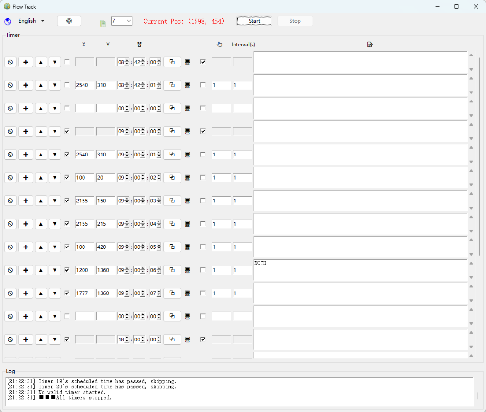

# “流痕”工具 Version 1.0 功能详述文档

本文件详细记录了“流痕”工具在 Version 1.0 时刻的所有核心功能。该工具旨在通过预设脚本化的定时任务，实现桌面操作的自动化，减少重复劳动，特别适用于需要精确时间点触发或多步骤流程执行的办公场景。

## 1. 软件界面一览

## 2. 核心功能点

### 2.1 高精度定时触发
- **时间精度**：支持 `HH:MM:SS` 格式的时间设定，精确到秒级别。
- **并发管理**：内部采用多线程处理逻辑，每个定时器任务独立运行，互不干扰。
- **过期跳过**：内置“时间补偿”逻辑。若启动时任务设定时间已过，系统会记录日志并自动跳过，优先执行后续有效任务。

### 2.2 任务配置与编辑
Version 1.0 提供了极其灵活的表格化任务管理系统：
- **动态增减**：支持在任意行位置插入新任务或删除现有任务。
- **任务排序**：提供“向上/向下”微调按钮，允许用户调整任务在列表中的逻辑显示顺序。
- **快速克隆**：
    - **单行复制**：点击“复制”图标可一键克隆该行配置。
    - **批量填充**：支持将当前行的设置（特别是时间、点击次数、间隔）快速批量同步到下方指定的连续行（默认为后续 7 行），并自动对秒数进行 +1 递增处理。

### 2.3 点击与文本交互
- **坐标驱动**：用户可手动输入 `X` 和 `Y` 坐标。
- **模拟点击**：支持设定“点击次数”和“点击间隔”。
- **文本输入**：独有的“粘贴文本”功能。在执行点击后，软件可自动将预设的文本内容填充到目标位置的剪贴板或直接进行粘贴模拟。
- **备注记录**：每行任务自带大型文本备注框，不仅用于记录脚本含义，更能作为工作流的文字说明。

### 2.4 特殊操作模式
- **“显示桌面”模式**：这是一个快捷动作选项。选中后，该任务会忽略 X/Y 坐标和文本输入，转而执行全局的“显示桌面”原生指令（Win+D 效果）。
- **坐标拾取助手**：在窗口顶部实时显示当前鼠标的绝对坐标（红色文字），极大降低了寻找目标点击点的难度。

### 2.5 软件配置与环境
- **多语言支持**：原生支持“中文”与“英文”切换，配置保存在 `language.ini`。
- **持久化存储**：
    - 软件自动将当前的窗口位置、大小、配置好的所有任务行保存至 `config.ini`。
    - 启动时自动恢复上次关闭前的所有任务状态。
- **日志监控**：底部提供实时的操作日志（Log），包括定时器激活、任务开始、任务跳过及系统错误提示。

## 3. 交互逻辑
1. **配置阶段**：用户通过顶部坐标提示获取 X/Y，填入表格，设置触发时间及点击逻辑。
2. **启动阶段**：点击“开始”按钮，系统进入监听状态。此时任务行会被锁定（不可编辑），按钮状态切换。
3. **执行阶段**：系统实时比对本地时间与任务时间。一旦匹配，立即触发对应的线程执行点击、文本粘贴或切回桌面操作。
4. **结束阶段**：用户点击“结束”或所有任务完成后，系统释放锁定状态。

## 4. 技术特性说明 (Version 1.0)
- **底层驱动**：基于 Python + Tkinter 构建，调用 Windows API 实现底层键鼠模拟。
- **并发机制**：使用 `threading` 模块保证 UI 响应不阻塞，任务执行不延时。
- **资源占用**：极低内存占用，适合长时间挂机运行。

---
*文档版本：v1.0.0*
*发布日期：2026-01-27*
