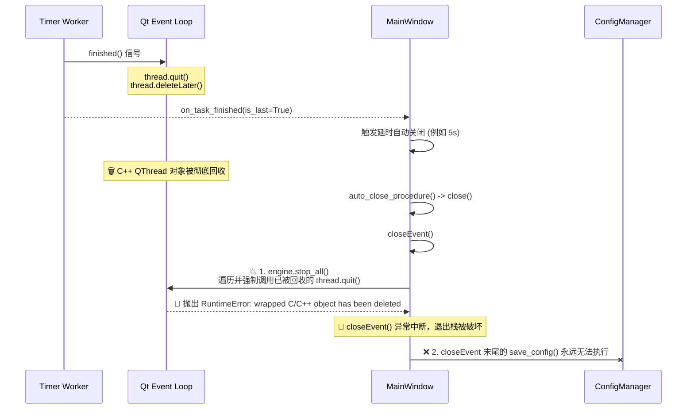
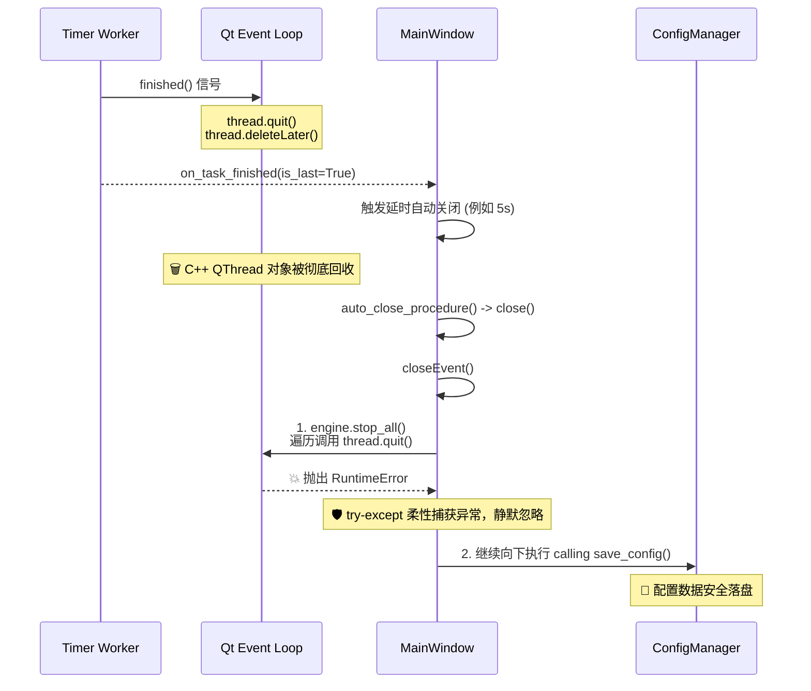

# Flow Track: 自动关闭配置丢存问题架构设计方案

## 1. 原理分析 (First Principles Analysis)

### 现象本质
用户报告指出了一个非常具体的生命周期差异：
- **手动中止**: 运行正常，配置被成功保存。
- **倒计时自然结束后的自动关闭**: 概率性或必然导致最后一次的修改不被持久化（`save_config()` 似乎没有被生效）。

### 根本原因溯源 (Root Cause)
通过深入审查 PySide6 生态系统与 `main_window.py` 及 `timer_engine.py` 的事件队列，我们锁定了**“悬空 C++ 对象引发的未捕获异常” (Dangling C/C++ Object RuntimeError)**。

1. **正常完结的清理陷阱**：当定时器自然耗尽时，`TimerWorker` 会发射 `finished` 信号，被绑定到 `thread.quit()` 与 `thread.deleteLater()`。这会通知 Qt 的 C++ 底层事件循环去销毁该 `QThread` 实例。
2. **延迟触发漏洞**：当最后一个定时器完成后，主窗口开始进入 `auto_close_delay_seconds` (例如 5 秒) 的自动关闭倒计时。在这个延时期内，C++ 底层的 `QThread` 对象已经被彻底垃圾回收释放。
3. **Python引用未对齐**：在 `TimerEngine` 中，`self.threads` 数组仍然持有对这些已被销毁的 C++ 对象的 Python Wrapper 引用（即悬空指针）。
4. **致命的异常中断**：时间到达，`auto_close_procedure` 调用了 `self.close()`，触发 `MainWindow.closeEvent()`。在 `closeEvent()` 中，执行的第一句代码是 `self.engine.stop_all()`。
5. **案发时刻**：`stop_all()` 会遍历 `self.threads` 并对它们强行调用 `thread.quit()`。此时由于底层的 C++ 对象已被回收，PySide6 抛出 `RuntimeError: wrapped C/C++ object of type QThread has been deleted`。
6. **灾难性后果**：因为这个异常没有被 `try-except` 捕获，`closeEvent` 直接**崩溃中断**，其下方的 `config.save_config(...)` 根本就**没有机会被执行到**！应用直接暴毙，配置因而落空。

而手动点击停止时，定时器绝大多数情况还没有自然结束，`deleteLater` 未被触发，C++ 对象尚存，因此 `stop_all()` 安全通过。

### 生命周期时序对比图 (Sequence Diagram)

#### 🐞 修改前 (Bug 发生时序):


#### ✅ 修改后 (安全着陆时序):


---

## 2. 备选解决方案 (Multiple Solutions)

我们要解决的是 C++ 对象销毁周期与 Python 的引用周期不一致问题：

### 方案 A：防护性僵尸对象清理 (Defensive Zombie Cleaning)
在线程池 `_clean_zombie` 或 `finished` 信号回调中，不仅将线程移入 `_zombie_pool`，同时**将其从 `self.threads` 中移除**。这样当调用 `stop_all()` 遍历 `self.threads` 时，就不会访问到已经自然完结的线程。
- **Pros (优点)**: 从架构层面上保持了列表纯洁性，真正解决了状态机不对齐的问题。
- **Cons (缺点)**: 需要在运行时通过信号去修改列表（List Mutation），存在多线程竞争的微小隐患，需确保严格锁 (`_pool_lock`)。

### 方案 B：关灯包容性异常捕获 (Graceful Exception Trapping)
不对 `self.threads` 生命周期做手术，而是直接在 `stop_all()` 的遍历逻辑中，使用 `try...except RuntimeError` 柔性捕获并忽略该错误。因为我们的意图就仅仅是“停止它”，既然它已经被 Qt 销毁了，那它天然已经被停止了。
- **Pros (优点)**: 改动极小（仅 2 行代码），异常容错度极高。防范了任何因为底层 QObject 生命周期导致的退出崩溃。
- **Cons (缺点)**: 掩盖了底层的“脏列表”现象，不够架构级优雅。

### 方案 C：Shiboken/SIP 存活探测校验 (C++ Liveness Probe)
在调用 `thread.quit()` 之前，专门探测底层 C++ 对象的状态。如果是 PySide6，可以通过包装工具验证。
- **Pros (优点)**: 避免抛出和捕获异常带来的微量开销。
- **Cons (缺点)**: PySide6 缺少跨版本高度一致的底层 probing API，强关联框架底层接口，可维护性较差。

---

## 3. 最终选定方案 (Selected Implementation Path)

作为 Lead Architect，考虑到这是一个生产级别软件，我们选择 **方案 A 与 方案 B 平行融合 (Hybrid Architecture)** 以达到最高可维护性并消除防御性设计漏洞。

具体修改位置为 `core/timer_engine.py -> TimerEngine.stop_all`：

1. **加入冗余捕获 (方案B)**：在强制调用 `thread.quit()` 时给予 `try-except RuntimeError` 包裹。这是程序的最后一道安全网。退出逻辑中不允许存在任何可导致崩溃导致未保存用户数据的异常泄漏。
2. **逻辑补充验证**：由于 C++ 对象被销毁，任何对该对象的方法调用都会引发 Runtime 异常。我们在退出阶段仅确保将其平稳过渡即可。

```python
# 示例变更意图 (禁止执行前修改)：
def stop_all(self):
    for worker in self.workers:
        try:
            worker.stop()
        except RuntimeError:
            pass
            
    with self._pool_lock:
        for thread in self.threads:
            try:
                thread.quit()
                self._zombie_pool.append(thread)
            except RuntimeError:
                # 线程对应的 C++ 对象已经被 Qt GC (如通过 deleteLater) 清理完毕
                # 这是自动完成定时任务之后的正常现象，予以静默忽略
                pass
            
    self.threads = []
    self.workers = []
```

---

## 4. 潜在风险评估 (Risk Assessment & Mitigation)

| 潜在风险 (Risk) | 严重度 (Severity) | 应对策略 (Mitigation Strategy) |
| :--- | :--- | :--- |
| **异常静默掩盖风险** | 低 (Low) | 仅针对特定的 `RuntimeError` 进行捕获，不使用宽泛的 `except Exception:` 以免掩盖例如死锁或系统权限的严重错误。 |
| **内存泄漏 (Memory Leak)** | 极低 (Minimal) | 此修复方案仍然保留了原有的 `self.threads = []` 以及僵尸收容池逻辑，且此时应用已经处于关闭流程中，操作系统将整体回收进程内存，不存在长时运行的泄漏危险。 |
| **工作队列竞争死锁** | 中 (Medium) | 继续利用并保持原有的 `with self._pool_lock:` 上下文管理器，确保此时没有其它异步 worker 尝试重写或读取队列。 |

---

```markdown
📌 配置文件丢失持久化失效 - 根因分析与架构修复方案
├── 🧠 核心问题 (Core Issue)
│   ├── 💥 案发时刻: 抛出 RuntimeError: C/C++ object has been deleted 异常
│   ├── ⏱️ 延迟漏洞: 自动关闭机制存在 x 秒的延时，给足了 Qt 底层销毁 C++ 对象的时间
│   └── 🛑 灾难后果: unhandled 异常彻底熔断了 closeEvent，致使下方 config_save 成为死代码
├── ⚖️ 对策对比 (Solutions)
│   ├── 方案A: 动态列表过滤 (优: 干净架构, 劣: 需控制高频锁竞争)
│   ├── 方案B: 异常柔性吞吐 (优: 代码高容错最小改动, 劣: 列表滞留脏引用)
│   └── 选定方案: Hybrid A+B (使用 try-except 包围 quit 动作，保证退出事件绝对畅通)
└── 🚀 结论 (Conclusion)
    └── ⏳ 进入保护刹车状态 (状态已锁定，等待用户下达 '执行' 指令)
```
