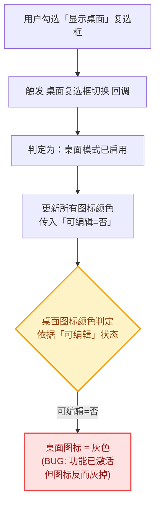
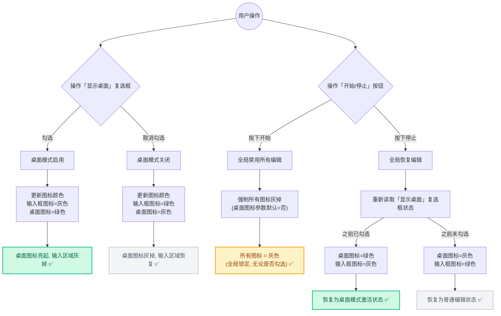
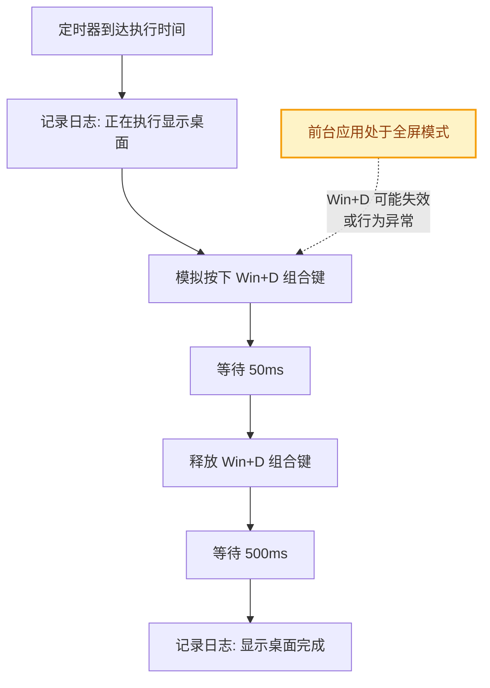
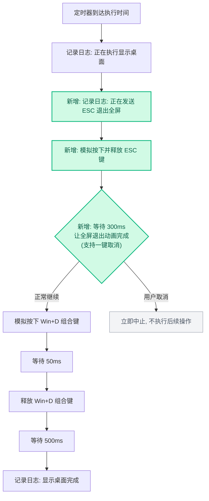

# 「显示桌面」功能增强设计方案

> **文档编号**: 20260729_Design_ShowDesktop_Enhancement  
> **日期**: 2026-07-29  
> **状态**: 🔒 待用户审批  
> **涉及模块**: `ui/components/timer_card.py`, `core/timer_engine.py`, `assets/language.ini`

---

## 1. 问题本质分析

本次改动涉及两个独立但相关的子问题：

### 子问题 A：桌面图标颜色状态反转 (Bug)

**现象**：勾选「显示桌面」复选框时，旁边的桌面图标（`fa5s.desktop`）变灰；取消勾选时图标变亮（绿色）。  
**用户期望**：勾选时图标亮起（表示"显示桌面功能已激活"），未勾选时图标灰掉（表示"未启用"）。

**根因追溯**：

在 [`timer_card.py`](../ui/components/timer_card.py) 的 `update_icon_states` 方法（第 315 行）中：

```python
color_desktop = color_theme if can_edit else color_muted
```

调用链为：`on_desktop_toggled(checked)` → `update_icon_states(can_edit=not is_desktop, ...)`

当 `is_desktop=True`（已勾选）时，`can_edit=False`，导致 `color_desktop=color_muted`（灰色）。

**结论：这是一个逻辑错误。** 桌面图标的颜色不应该跟随 `can_edit` 参数（该参数控制的是坐标/点击次数/间隔等输入参数区域的可编辑性），而应独立反映「显示桌面」功能本身的激活状态。

### 子问题 B：显示桌面前先退出全屏 (功能增强)

**场景**：某些应用（如视频播放器、浏览器全屏、演示文稿等）处于全屏模式时，Windows 的 `Win+D`（显示桌面）快捷键可能无法正常最小化这些窗口，或者行为不一致。  
**用户期望**：在执行 `Win+D` 之前，先模拟一次 `ESC` 按键，以退出前台应用的全屏模式，确保后续「显示桌面」操作的可靠性。

**当前执行逻辑位置**：[`timer_engine.py`](../core/timer_engine.py) 第 66-79 行。

---

## 2. 修改前后流程图对比

### 子问题 A：桌面图标颜色逻辑 — 修改前 vs 修改后

#### 🔴 修改前（Bug 状态）



> **🐛 Bug 根因**：桌面图标的颜色与「输入框可编辑性」参数共享了同一个判定逻辑。该参数的设计意图是：勾选桌面模式后，坐标/点击次数等输入框应变灰不可编辑。但桌面图标本身也被这个逻辑波及，导致"功能已激活，图标却灰掉"的反直觉表现。

#### 🟢 修改后（方案 A-1：完整状态机）

下图覆盖了桌面图标在**所有用户操作场景**下的颜色表现，包括勾选/取消、按「开始」全局锁定、按「停止」恢复三个关键路径：



> **✅ 对策**：为图标颜色更新函数新增一个独立的「桌面激活」参数（默认值为"否"），桌面图标颜色仅跟随此参数。原有的「可编辑」参数继续控制输入框相关图标，两者完全解耦。  
> **关键保障**：全局锁定时不传「桌面激活」参数，默认为"否" → 桌面图标必定灰掉，不会因勾选状态而误亮。

---

### 子问题 B：显示桌面执行流程 — 修改前 vs 修改后

#### 🔴 修改前（缺少全屏退出）



> **⚠️ 问题**：如果前台应用（浏览器、播放器等）处于全屏模式，`Win+D` 可能无法正常最小化所有窗口。

#### 🟢 修改后（方案 B-1：ESC 退出全屏）



> **✅ 对策**：在 `Win+D` 之前插入 ESC 按键 + 300ms 等待。ESC 在非全屏场景下无副作用；等待期间仍支持一键取消。


---

## 3. 方案设计

### 子问题 A：桌面图标颜色修复

#### 方案 A-1：桌面图标颜色独立于 `can_edit` (推荐 ✅)

**核心思路**：为桌面图标引入独立的颜色逻辑，不再与 `can_edit` 复用。

**具体改动**：

| 文件 | 行号 | 改动内容 |
|------|------|----------|
| [`timer_card.py`](../ui/components/timer_card.py) | 第 298 行 | `update_icon_states` 增加 `desktop_active` 参数 |
| [`timer_card.py`](../ui/components/timer_card.py) | 第 315 行 | `color_desktop` 改为跟随 `desktop_active` 而非 `can_edit` |
| [`timer_card.py`](../ui/components/timer_card.py) | 第 282 行 | 调用处传入 `desktop_active=is_desktop` |
| [`timer_card.py`](../ui/components/timer_card.py) | 第 294 行 | `update_after_theme_change` 调用处传入 `desktop_active` |
| [`timer_card.py`](../ui/components/timer_card.py) | 第 516 行 | `set_editing_enabled(False)` 调用处传入 `desktop_active=False` |

**逻辑变更**：

```python
# 修改前
color_desktop = color_theme if can_edit else color_muted

# 修改后
color_desktop = color_theme if desktop_active else color_muted
```

这使得：
- 勾选「显示桌面」→ `desktop_active=True` → 图标亮起（绿色）✅
- 未勾选 → `desktop_active=False` → 图标灰掉 ✅
- 全局运行时禁用 → `desktop_active=False` → 图标灰掉 ✅

| 优点 | 缺点 |
|------|------|
| 语义清晰，桌面图标有独立的控制逻辑 | 需要修改 `update_icon_states` 的函数签名（增加参数） |
| 不影响其他图标（鼠标、时钟等）的现有行为 | 需要审查所有调用点确保新参数被正确传入 |
| 易于理解和维护 | — |

#### 方案 A-2：简单取反 `can_edit` 对桌面图标的作用

**核心思路**：仅在第 315 行将条件取反。

```python
# 修改前
color_desktop = color_theme if can_edit else color_muted

# 修改后
color_desktop = color_theme if not can_edit else color_muted
```

| 优点 | 缺点 |
|------|------|
| 改动量极小（仅 1 行） | **严重副作用**：全局禁用时 `can_edit=False`，此时桌面图标会亮起——但用户并未勾选显示桌面，这是错误的状态表达 |
| 无需修改函数签名 | 语义不清晰，`can_edit` 的含义被扭曲 |

> ⚠️ **方案 A-2 存在"全局锁定时的状态误表达"问题，不推荐。**

#### 最终建议：**采用方案 A-1**

---

### 子问题 B：显示桌面前发送 ESC 键

#### 方案 B-1：在 `Win+D` 前直接发送 ESC 键 (推荐 ✅)

**核心思路**：在 [`timer_engine.py`](../core/timer_engine.py) 的 `show_desktop` 执行分支中，于 `Win+D` 之前插入 `ESC` 按键模拟。

**具体改动**：

| 文件 | 行号 | 改动内容 |
|------|------|----------|
| [`timer_engine.py`](../core/timer_engine.py) | 第 67-68 行之间 | 在日志输出后、`Win+D` 之前，插入 ESC 按键逻辑 |
| [`assets/language.ini`](../assets/language.ini) | 中文/英文段落 | 新增 ESC 退出全屏的日志消息 |

**执行序列**：

```
1. 日志: "正在执行显示桌面..."
2. [新增] 日志: "正在发送 ESC 以退出全屏模式..."
3. [新增] 发送 ESC 按键 (keybd_event VK_ESCAPE down + up)
4. [新增] 等待 300ms (让全屏退出动画完成)
5. [已有] 发送 Win+D 组合键
6. [已有] 等待 500ms
7. 日志: "显示桌面完成"
```

**关键代码**：

```python
if show_desktop:
    self.log.emit(self.get_msg("log_timer_show_desktop", timer_no=timer_no))
    
    # [新增] 退出全屏模式
    self.log.emit(self.get_msg("log_timer_esc_fullscreen", timer_no=timer_no))
    win32api.keybd_event(win32con.VK_ESCAPE, 0, 0, 0)
    win32api.keybd_event(win32con.VK_ESCAPE, 0, win32con.KEYEVENTF_KEYUP, 0)
    if self.cancel_event.wait(0.3): return  # 等待全屏退出
    
    # [已有] 显示桌面
    win32api.keybd_event(win32con.VK_LWIN, 0, 0, 0)
    win32api.keybd_event(ord('D'), 0, 0, 0)
    # ... 后续已有逻辑不变
```

| 优点 | 缺点 |
|------|------|
| 实现简单、逻辑清晰 | ESC 键在非全屏场景下也会被发送（影响极小，因为大多数应用忽略无效 ESC） |
| 与现有代码架构完全一致 | 部分应用可能将 ESC 映射为关闭窗口（如某些对话框），可能产生非预期效果 |
| 300ms 等待时间对用户几乎无感 | — |
| 完全沿用现有的 `cancel_event.wait()` 可取消模式 | — |

#### 方案 B-2：检测前台窗口是否全屏后再发送 ESC

**核心思路**：先通过 Win32 API 检测前台窗口是否处于全屏模式，仅在全屏状态下发送 ESC。

**关键 API**：
```python
import win32gui

hwnd = win32gui.GetForegroundWindow()
rect = win32gui.GetWindowRect(hwnd)
screen_w = win32api.GetSystemMetrics(0)
screen_h = win32api.GetSystemMetrics(1)
is_fullscreen = (rect == (0, 0, screen_w, screen_h))
```

| 优点 | 缺点 |
|------|------|
| 仅在真正全屏时发送 ESC，避免误触 | 检测方法不可靠：多显示器环境、DPI 缩放、无边框窗口等场景均可能误判 |
| 更"精确"的行为 | 增加了代码复杂度和额外的 Win32 API 依赖（`win32gui`） |
| — | 实际收益有限：非全屏时发送 ESC 几乎无副作用 |
| — | 违反 KISS 原则 |

#### 最终建议：**采用方案 B-1**

直接发送 ESC 是最简单、最可靠的方案。ESC 键本身是"安全"的操作键——在绝大多数上下文中，它要么退出全屏、要么无任何效果。其副作用风险极低，远低于引入复杂检测逻辑的维护成本。

---

## 3. 完整改动清单

| 文件 | 改动类型 | 说明 |
|------|----------|------|
| [`timer_card.py`](../ui/components/timer_card.py) | **修改** | `update_icon_states` 增加 `desktop_active` 参数；修复桌面图标颜色逻辑；更新所有调用点 |
| [`timer_engine.py`](../core/timer_engine.py) | **修改** | 在 `show_desktop` 分支中插入 ESC 按键逻辑 |
| [`language.ini`](../assets/language.ini) | **修改** | 新增 `log_timer_esc_fullscreen` 中英文日志消息 |

---

## 4. 风险评估

| 风险 | 严重程度 | 概率 | 缓解措施 |
|------|----------|------|----------|
| **ESC 关闭了前台对话框/弹窗** | 🟡 中 | 低 | 此操作仅在用户明确启用「显示桌面」模式的定时器行上触发，用户有预期。且 300ms 后才执行 Win+D，给用户充分反应时间 |
| **全屏退出动画未在 300ms 内完成** | 🟢 低 | 极低 | 主流应用（浏览器、播放器）的全屏退出通常在 100-200ms 内完成。若不够，可将等待时间提升至 500ms |
| **`update_icon_states` 签名变更遗漏调用点** | 🔴 高 | 低 | 使用默认参数 `desktop_active=False`，确保所有未显式传入的调用点行为不变 |
| **多显示器/远程桌面环境下 ESC 行为异常** | 🟢 低 | 极低 | ESC 键是操作系统级标准输入，不受多显示器影响 |
| **取消操作（`cancel_event`）在 ESC 等待期间的中断** | 🟢 低 | — | 新增的 `wait(0.3)` 沿用现有的 `cancel_event.wait()` 模式，取消操作可立即生效 |

---

## 5. 验证计划

### 自动验证
- 构建并启动应用，确认无异常/崩溃

### 手动验证矩阵

| 测试场景 | 预期结果 |
|----------|----------|
| 勾选「显示桌面」复选框 | 桌面图标亮起（绿色），坐标/点击等参数区域灰掉 |
| 取消勾选「显示桌面」 | 桌面图标灰掉，参数区域恢复可编辑 |
| 全局「开始」运行时，有勾选的行 | 桌面图标灰掉（全局锁定优先） |
| 全局「停止」后，有勾选的行恢复 | 桌面图标亮起 |
| 切换主题（亮色↔暗色），有勾选的行 | 桌面图标颜色正确跟随主题（亮色模式绿 `#26D07C` / 暗色模式绿 `#22C55E`） |
| 全屏浏览器打开时，执行「显示桌面」定时器 | 先退出全屏，再显示桌面 |
| 无全屏应用时，执行「显示桌面」定时器 | ESC 被发送但无可见效果，随后正常显示桌面 |

---

## 6. 调查覆盖声明

### 已扫描的核心文件清单

| 文件 | 扫描目的 |
|------|----------|
| `ui/components/timer_card.py` (517 行) | 图标颜色逻辑、`update_icon_states` 所有调用点 |
| `core/timer_engine.py` (195 行) | `show_desktop` 执行逻辑 |
| `ui/styles/theme_config.py` (138 行) | 主题颜色定义 (`ICON_COLOR`, `ICON_COLOR_MUTED`) |
| `assets/language.ini` (184 行) | 现有日志消息键 |
| `core/config_manager.py` (部分) | `show_desktop` 的配置读写 |
| `ui/main_window.py` (部分) | `show_desktop` 在主窗口中的数据流 |

### 排除范围

- `ui/styles/theme.qss` / `theme_template.qss`：本次改动不涉及 QSS 样式，仅涉及 Python 代码层面的图标颜色设置（通过 `qtawesome` pixmap）。
- `doc/` 目录下的历史设计文档：仅作参考，不修改。
- `build/` / `dist/`：构建产物，不直接修改。

---

```markdown
📌 「显示桌面」功能增强设计总览
├── 🐛 子问题 A：图标颜色状态反转修复
│   ├── 🔍 根因：桌面图标颜色复用了 can_edit 参数逻辑
│   ├── ✅ 方案 A-1 (推荐)：增加 desktop_active 独立参数
│   │   └── 📝 改动文件：timer_card.py (函数签名 + 5 处调用点)
│   └── ❌ 方案 A-2 (不推荐)：简单取反 → 全局锁定时状态误表达
├── 🚀 子问题 B：显示桌面前退出全屏
│   ├── ✅ 方案 B-1 (推荐)：直接发送 ESC 键
│   │   ├── 📝 改动文件：timer_engine.py (插入 ESC 逻辑)
│   │   └── 📝 改动文件：language.ini (新增日志消息)
│   └── ❌ 方案 B-2 (不推荐)：检测全屏状态 → 复杂且不可靠
├── ⚠️ 风险评估
│   ├── 🟡 ESC 关闭前台对话框（概率低，影响中）
│   ├── 🟢 全屏退出动画延迟（概率极低）
│   └── 🔴 函数签名变更遗漏调用点（通过默认参数缓解）
└── ✅ 验证计划
    ├── 🔨 构建启动验证
    └── 🧪 7 项手动测试用例
```
